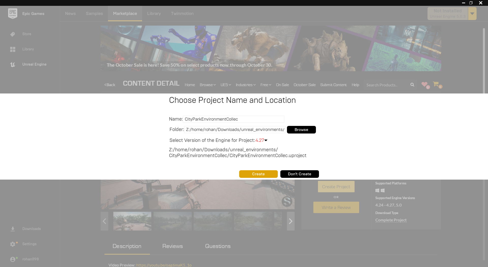

<p align="center"><b><ins> Setting up a Custom AirSim Environment in Linux </ins></b></p>

<br>

---

<br>

- The stuff is mostly straight out of the [documentation](https://github.com/microsoft/AirSim/blob/main/docs/unreal_custenv.md), but with minor tweaks needed for my system.

<br>

---

<br>

- Since there is no Epic Games launcher for Linux, we need either a Windows Machine, a virtual windows machine, or Lutris for Linux.


<br>

---

<br>

<b><ins> Step 1 </ins></b>

- Download a custom environment. The AirSim documentation recommends downloading the Landscape Mountains, but since it's not readily available for UE4.27, an easier alternative is the City Park Environment Collection environment.

Navigate to: 

Epic Games Launcher > Unreal Engine > MarketPlace > Search "City Park Environment Collection environment"

<br>

---

<br>

<b><ins> Step 2 </ins></b>

1. Click on Create Project
2. Change the Engine Version to 4.27
3. Modify the folder location to the desired one.
4. Click on Create

(Same process for Windows VM. Copy over the project folder to the Linux machine. Please see step 3 for where to place the project folder.)

<br>



- The project is downloaded to "/home/rohan/Downloads/unreal_environments/CityParkEnvironmentCollec".

<br>

---

<br>

<b><ins> Step 3 </ins></b>

- Move the entire project directory to the AirSim Environments directory.

```
cp -r CityParkEnvironmentCollec /home/rohan/AirSim/Unreal/Environments
```

<br>

---

<br>

<b><ins> Step 4 </ins></b>

- Copy the "clean.sh" file from "AirSim/Unreal/Environments/Blocks" to the current project.
- Copy the AirSim plugin from "AirSim/Unreal/Plugins" to the current project.

```
cd AirSim/Unreal/Environments/CityParkEnvironmentCollec

cp ../Blocks/clean.sh ./
cp -r ~/AirSim/Unreal/Plugins ./

```

<br>

---

<br>

<b><ins> Step 5 </ins></b>

- We should technically be able to launch the project now, but there's a bit more work for Linux machines.
- Here's what happens if we launch the project.

```
cd ~/UnrealEngine/Engine/Binaries/Linux

./UE4Editor
```

- Navigate to the project folder.

More > Browse > ProjectName.uproject


<br>

- If we try to open this, we get an error similar to this:


<br>

- Okay, so there are a couple of things to do before we open it up.

<br>

- Add this line to "Config/DefaultGame.ini"

```
+MapsToCook=(FilePath="/AirSim/AirSimAssets")
```

<br>

- [This issue](https://github.com/microsoft/AirSim/issues/4535#issuecomment-1136095046) helped quite a bit.
- Assuming the first 4 steps were followed from this answer, run

```
cd AirSim/Unreal/Environments/CityParkEnvironmentCollec

./clean.sh

~/UnrealEngine/Engine/Binaries/ThirdParty/Mono/Linux/bin/mono ~/UnrealEngine/Engine/Binaries/DotNET/UnrealBuildTool.exe Development Linux -Project=/home/rohan/AirSim/Unreal/Environments/CityParkEnvironmentCollec/CityParkEnvironmentCollec.uproject -TargetType=Editor -Progress

```

- Navigate to Unreal Engine and open the editor. 
- Open the .uproject file as described above.
- After quite some time, the project should open and look like this:


- If Unreal still gives a prompt to convert the project, choose "More Options" and select "Skip Conversion".

<br>

---

<br>

<b><ins> Step 6 </ins></b>

- Select Player Start object from the "Place Actors" panel, and place it on the desired location. This will be where the drone is spawned.


<br>

- Navigate to the "World settings" (Window -> World Settings); usually visible on the right.
- Change the Game Mode to "AirSimGameMode".


<br>

---

<br>

That's it!

<br>

---

- Test the environment by clicking on "Play".
- The drone should be visible at the "Player Start" location.


<br>

- Below is a test file called taken from [here](https://github.com/microsoft/AirSim/blob/main/docs/apis.md).

```
# ready to run example: PythonClient/multirotor/hello_drone.py
import airsim
import os

# connect to the AirSim simulator
client = airsim.MultirotorClient()
client.confirmConnection()
client.enableApiControl(True)
client.armDisarm(True)

# Async methods returns Future. Call join() to wait for task to complete.
client.takeoffAsync().join()
client.moveToPositionAsync(-10, 10, -10, 5).join()

# take images
responses = client.simGetImages([
    airsim.ImageRequest("0", airsim.ImageType.DepthVis),
    airsim.ImageRequest("1", airsim.ImageType.DepthPlanar, True)])
print('Retrieved images: %d', len(responses))

# do something with the images
for response in responses:
    if response.pixels_as_float:
        print("Type %d, size %d" % (response.image_type, len(response.image_data_float)))
        airsim.write_pfm(os.path.normpath('./capture/py1.pfm'), airsim.get_pfm_array(response))
    else:
        print("Type %d, size %d" % (response.image_type, len(response.image_data_uint8)))
        airsim.write_file(os.path.normpath('./capture/py1.png'), response.image_data_uint8)
```

<br>

- Ensure that the simulation is running.
- Run the python file in a terminal:
- Toggle 0 for all camera views (1, 2, 3 for individual camera views).

```
python3 hello_drone.py
```


