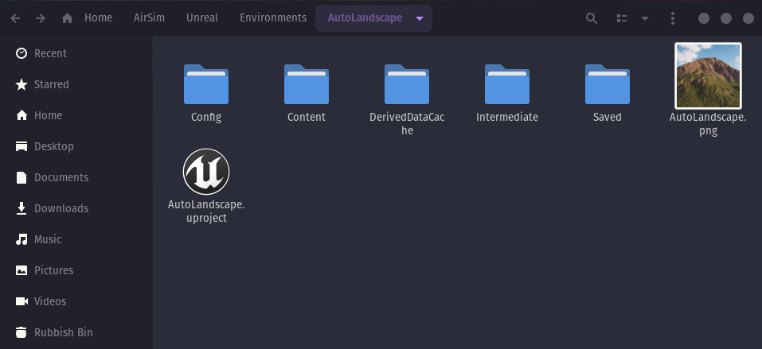
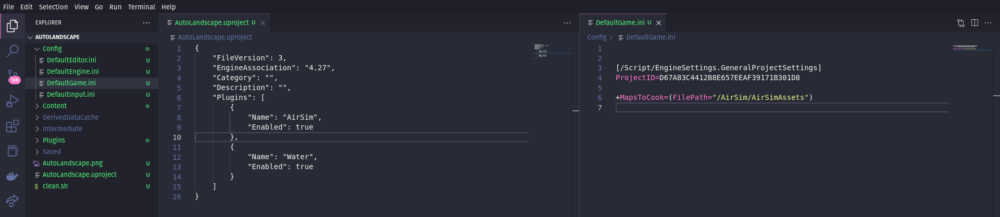
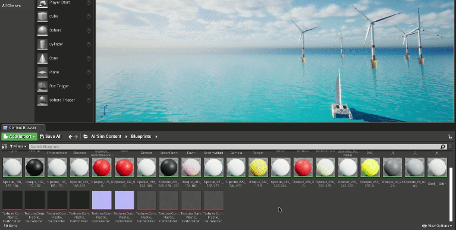
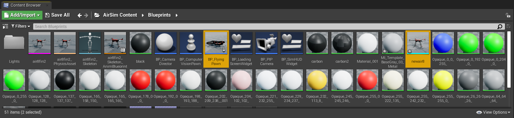
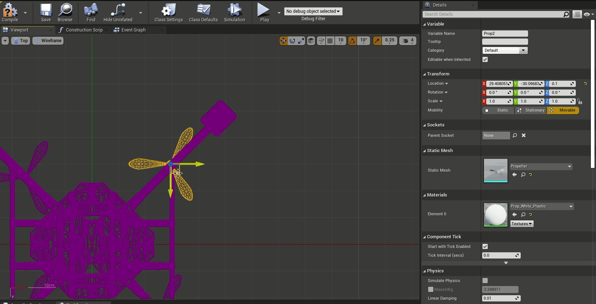
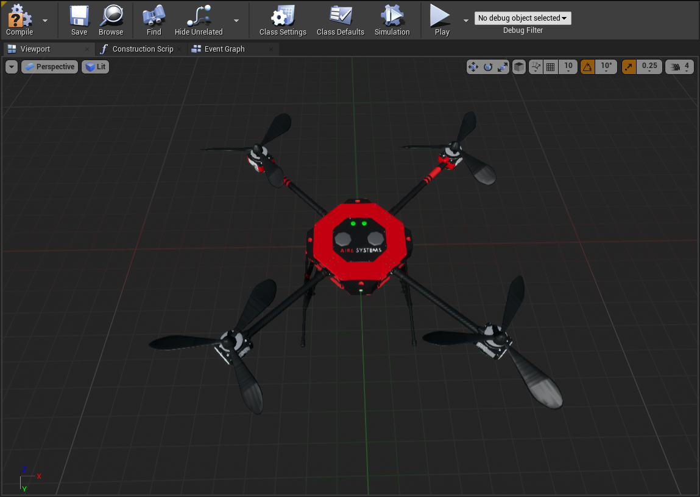
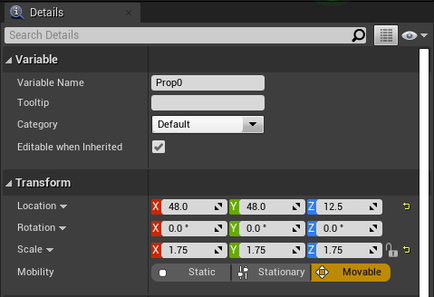
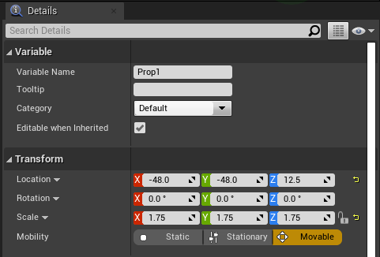
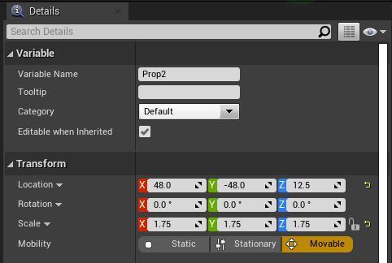

<h2><p align="center"><b><ins> Using a Custom Air8 in Unreal with AirSim </ins></b></p></h2>

<br>

---

<br>

- Notes on how to import a custom drone in Unreal Engine with AirSim.
- Here, the Wind Farm environment is used, but this should work with any standard Unreal Environment.

<br>

---

<br>

- The Wind Farm environment is called AutoLandscape in this case, and has the following structure:


<br>

<h3><ins> Step 1 </ins></h3>

<br>

- Copy the clean.sh script from the default "Blocks" environment
	```
	cp ~/AirSim/Unreal/Environments/Blocks/clean.sh ./
	```

<br>

- Copy the AirSim plugin to the current environment
	```
	cp -r ~/AirSim/Unreal/Plugins ./
	```

<br>

- Run "clean.sh" to clean the project files. We will generate new project files after a few modifications.
	```
	./clean.sh
	```

<br>

---

<h3><ins> Step 2 </ins></h3>

- Open up a code editor.
- Open ```your_project.uproject``` (AutoLandscape.uproject in this case) as well as ```DefaultGame.ini``` in the code editor.

<br>

- Add the AirSim plugin to the ```.uproject``` file. (If there are other plugins in the environment, keep them as it is).
	```
	{
		"FileVersion": 3,
		"EngineAssociation": "4.27",
		"Category": "",
		"Description": "",
		"Plugins": [
			{
				"Name": "AirSim",
				"Enabled": true
			}
		]
	}
	```

<br>

- Tell Unreal to cook the AirSim along with the rest of the environment by adding the last line to the ```DefaultGame.ini``` file
	```
	[/Script/EngineSettings.GeneralProjectSettings]
	ProjectID=D67A83C4412B8E657EEAF39171B301D8

	+MapsToCook=(FilePath="/AirSim/AirSimAssets")
	```

<br>

- The modified files should look similar to this:


<br>

- The code editor can be closed now.

<br>

- To generate project files on Linux, we first have to install [mono](https://linuxize.com/post/how-to-install-mono-on-ubuntu-20-04/).
- Create a symbolic link:
	```
	sudo ln -s /usr/bin/mono /bin/mono && sudo ln -s /usr/lib/mono /lib/mono
	```

<br>

- Generate Project files:
	```
	~/UnrealEngine/Engine/Binaries/ThirdParty/Mono/Linux/bin/mono ~/UnrealEngine/Engine/Binaries/DotNET/UnrealBuildTool.exe Development Linux -Project=/home/rohan/AirSim/Unreal/Environments/AutoLandscape/AutoLandscape.uproject -TargetType=Editor -Progress
	```

- Change the path after the ```-Project``` flag to your project name.

<br>

[This issue was used for reference.](https://github.com/microsoft/AirSim/issues/4535#issuecomment-1136095046)

<br>


- Open up the newly built environment in Unreal.
	```
	cd ~/UnrealEngine/Engine/Binaries/Linux
	```

	```
	./UE4Editor /home/rohan/AirSim/Unreal/Environments/AutoLandscape/AutoLandscape.uproject
	```

<br>

---

<br>

<h3><ins> Step 3 </ins></h3>

- Navigate to the ```AirSim/Content/Blueprints``` directory through Unreal:


<br>

- Copy over all the drone assets into the ```AirSim/Content/Blueprints``` directory:
	```
	cp -r ./Content/newAIR8/* ./Plugins/AirSim/Content/Blueprints
	```

<br>

- Import the custom drone into Unreal:


<br>

---

<br>

<h3><ins> Step 4 </ins></h3>

- The Content Browser now should show the ```BP_FlyingPawn``` and the custom drone (here, ```newair8```).


<br>

- Right click on the ```BP_FlyingPawn``` asset and Create a Duplicate.
- Rename it ```BP_Air8```.
- Double click on ```BP_Air8``` to open it up, and navigate to ```Viewport```.

<br>

- Change the mesh of the default copter to the custom mesh imported earlier.


<br>

- Align the propellers correctly with the custom drone.
- Remember to scale it proportionally.


<br>

- Here's what the modified drone should look like:


<br>

- Set up 4 propellers with the following parameters:

Propeller 0             |  Propeller 1     |   Propeller 2   |    Propeller 3
:-------------------------:|:-------------------------:|:-------------------------:|:-------------------------:
  |    |    |  


<br>

---

<br>

<h3><ins> Step 5 </ins></h3>

- In the ```World Settings``` on the right, change ```None``` to ```AirSimGameMode```.
- Drag the ```Player Start``` from the Place Actors panel and drop it where you want the AirSim drone to spawn.


<br>

---

<br>

<h3><ins> Step 6 </ins></h3>

- Lastly, the AirSim settings need to be changed.
- Open up the ```settings.json``` in ~/Documents/AirSim/settings.json

<br>

- Modify it to look something like this:
```
{
  "SettingsVersion": 1.2,
  "SimMode": "Multirotor",
  "PawnPaths": {
    "DefaultQuadrotor": {"PawnBP": "Class'/AirSim/Blueprints/BP_Air8.BP_Air8_C'"}
    }
}
```

<br>

---

And that's it! <br>
The custom drone now should work with AirSim.

